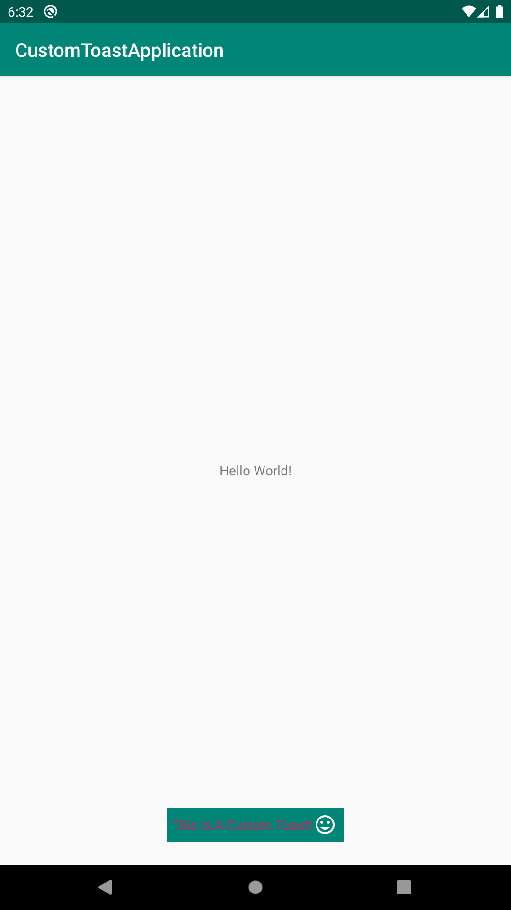
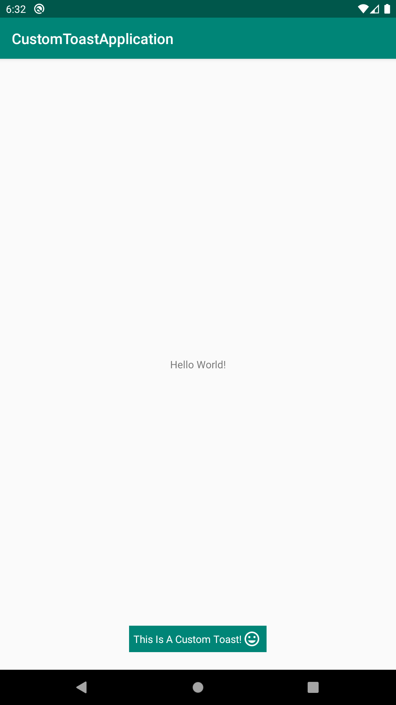

# CustomToastNotification
Simple Toast notifications is one of android libs that helping you to create toast with icon, message and color in one line.


## Getting Started

These instructions will get you a copy of the project up and running on your local machine for development and testing purposes. See deployment for notes on how to deploy the project on a live system.


### Installing

A step by step series of examples that tell you have to get a development env running

Say what the step will be

```
allprojects {
		repositories {
			maven { url 'https://jitpack.io' }
		}
	}
```

```
dependencies {
	   implementation 'com.github.MahmoudZaherDeveloper:CustomToastNotification:1.0'

	}
```


### And coding style tests

## Library functionality relies on CustomToast class.

* Kotlin code 
```
CustomToast.showCustomToast(
            this,
            R.drawable.ic_toast_icon,
            R.color.colorPrimary,
            R.color.colorAccent,
            "This Is A Custom Toast!"
        )
        
 Paramters will be as below:
 showCustomToast(
             mContext: Context,
             toastIcon: Int,
             toastBackgroundColor: Int,
             toastTextColor: Int,
             toastMessage: String
         )
```

* Screenshots  
 

## Contributing
All pull requests are welcome, make sure to follow the contribution guidelines when you submit pull request.

1. Fork it!
2. Checkout the development branch: git checkout development
3. Create your feature branch: git checkout -b my-new-feature
4. Add your changes to the index: git add .
5. Commit your changes: git commit -m 'Add some feature'
6. Push to the branch: git push origin my-new-feature
7. Submit a pull request against the development branch

## Authors

* **Mahmoud Zaher** 

